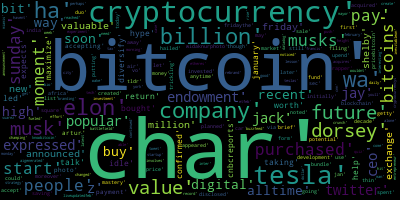
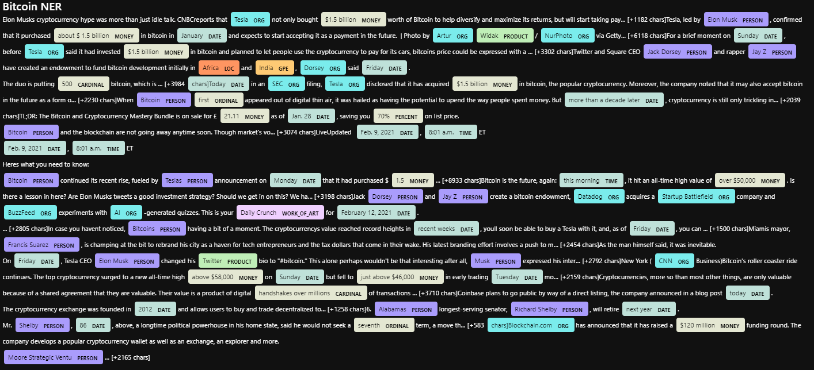

# NLP_homework_uw_fintech
---
Q: Which coin had the highest mean positive score?

A: From this corpus sample of n = 18, Bitcoin has a higher mean positive sentiment score than the n = 18 corpus sample of Ethereum with 0.051300

Q: Which coin had the highest compound score?

A: Bitcoin has the higher max compound sentiment value of 0.921700, compared to Ethereum with 0.709600. 

Q. Which coin had the highest positive score?

A: Bitcoin has the higher max postive sentiment value of 0.353000, compared to Ethereum with 0.144000.
  
### Bitcoin Sentiment DataFrame
---
|   |       date |                                              text |                                            tokens | compound | positive | negative | neutral |
|--:|-----------:|--------------------------------------------------:|--------------------------------------------------:|---------:|---------:|---------:|--------:|
| 0 | 2021-02-08 | Elon Musks cryptocurrency hype was more than j... | [elon, musks, cryptocurrency, hype, wa, idle, ... |   0.3182 |    0.091 |    0.000 |   0.909 |
| 1 | 2021-02-09 | Tesla, led by Elon Musk, confirmed that it pur... | [tesla, led, elon, musk, confirmed, purchased,... |   0.3818 |    0.071 |    0.000 |   0.929 |
| 2 | 2021-02-09 | For a brief moment on Sunday, before Tesla sai... | [brief, moment, sunday, tesla, invested, billi... |  -0.1027 |    0.000 |    0.038 |   0.962 |
| 3 | 2021-02-12 | Twitter and Square CEO Jack Dorsey and rapper ... | [twitter, square, ceo, jack, dorsey, rapper, j... |   0.2500 |    0.056 |    0.000 |   0.944 |
| 4 | 2021-02-08 | Today in an SEC filing, Tesla disclosed that i... | [today, sec, filing, tesla, disclosed, ha, acq... |   0.6597 |    0.137 |    0.000 |   0.863 |
  
### Ethereum Sentiment DataFrame
---
|   |       date |                                              text |                                            tokens | compound | positive | negative | neutral |
|--:|-----------:|--------------------------------------------------:|--------------------------------------------------:|---------:|---------:|---------:|--------:|
| 0 | 2021-02-18 | Worried that the GeForce RTX 3060 will be sold... | [worried, geforce, rtx, sold, cryptocurrency, ... |  -0.3400 |    0.063 |    0.119 |   0.818 |
| 1 | 2021-01-28 | Coinbase plans to go public by way of a direct... | [coinbase, plan, go, public, way, direct, list... |   0.0000 |    0.000 |    0.000 |   1.000 |
| 2 | 2021-02-04 | FILE PHOTO: Representation of the Ethereum vir... | [file, photo, representation, ethereum, virtua... |   0.0000 |    0.000 |    0.000 |   1.000 |
| 3 | 2021-02-03 | By Reuters Staff\r\nFILE PHOTO: Representation... | [reuters, stafffile, photo, representation, et... |   0.0000 |    0.000 |    0.000 |   1.000 |
| 4 | 2021-02-20 | While the first Christie's auction of digital ... | [first, christies, auction, digital, artwork, ... |   0.0258 |    0.030 |    0.000 |   0.970 
  
### Bitcoin Bigram
---
|     |                    bigram | count |
|----:|--------------------------:|------:|
|  27 |        (billion, bitcoin) |     3 |
|   0 |             (elon, musks) |     2 |
|  99 |           (char, bitcoin) |     2 |
|  89 | (popular, cryptocurrency) |     2 |
|  62 |            (jack, dorsey) |     2 |
| ... |                       ... |   ... |
  
### Etherum Bigram
---
|     |          bigram | count |
|----:|----------------:|------:|
| 138 |  (record, high) |     6 |
|  62 | (char, reuters) |     5 |
| 130 |  (feb, reuters) |     5 |
| 145 |     (char, new) |     4 |
| 146 |     (new, york) |     4 |
| ... |             ... |   ... |
  
### Top 10 Bitcoin Words
[('char', 18),
 ('bitcoin', 12),
 ('cryptocurrency', 8),
 ('tesla', 6),
 ('elon', 4),
 ('wa', 4),
 ('billion', 4),
 ('ha', 4),
 ('company', 4),
 ('musk', 3)]
  
### Top 10 Ethereum Words
[('char', 20),
 ('reuters', 15),
 ('ethereum', 13),
 ('cryptocurrency', 7),
 ('week', 7),
 ('bitcoin', 7),
 ('high', 7),
 ('new', 6),
 ('record', 6),
 ('february', 5)]
  
### Bitcoin Wordcloud
---

  
### Ethereum Wordcloud
---

  
### Bitcoin Named Entity Recognition
---

  
### Ethereum Named Entity Recognition
---

